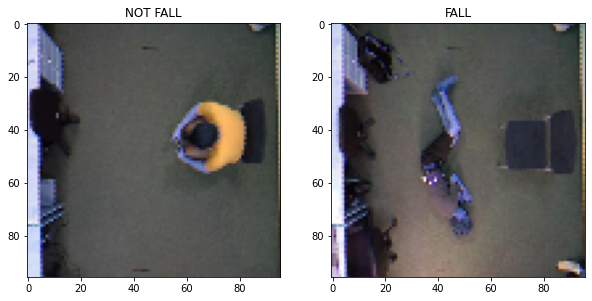
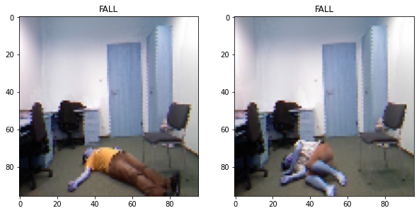

   Un sistema camera-based per la fall detection in ambienti indoor

---

    <b>FallDetection</b> è un progetto di <b>Deep Learning</b> realizzato in <b>Google Colab</b> per la tesi di laurea magistrale in Ingegneria Informatica.
</b>

# 📔 Tabella dei contenuti

- [Presentazione del progetto](#panoramica)
- [Tecnologie di base](#tecno)
- [Test eseguiti](#test)
- [Workflow Iterazioni](#workflow)
- [Obiettivi futuri](#obiettivi)
- [Autore](#autore)

# 📝 Presentazione del progetto 

<table>
  <tr>
    
    
  </tr>
L’obiettivo di questa tesi è quello di costruire un sistema affidabile
per la rilevazione delle cadute basato su visione. La definizione del
problema è molto semplice. Si tratta di cercare di capire quando
una persona sta cadendo o è caduta. Nonostante il concetto
sia molto semplice, nella realtà dei fatti però per un sistema
artificiale può essere complessa l’interpretazione della posa delle
persone, in quanto queste possono compiere azioni apparentemente
sospette ma che non hanno niente a che fare con una caduta (ad
esempio abbassarsi per terra per raccogliere un oggetto, sdraiarsi
sul letto, sedersi per terra e cosi via). L’attività che rileva le
cadute si chiama fall detection ed è una tecnologia che monitora i
movimenti di una persona, rileva eventuali cadute che si verificano
ed eventualmente genera un allarme. A seguito dell’identificazione
dell’evento, si può avvisare l’operatore sanitario o l’assistente della
persona mediante smartphone. I sistemi di fall detection non sono
limitati solo alle persone anziane. Possono anche essere utilizzati
per proteggere atleti, lavoratori o chiunque sia a maggior rischio di
caduta. Le telecamere possono avere un posizionamento frontale
rispetto alla posizione della stanza, oppure possono essere poste
sul soffitto, in modo tale da aquisire la pianta dell’edificio che si
intende monitorare. 

# 🧰 Tecnologie di base 

Il lato frontend dell’applicativo...

...

# 🧪 Test eseguiti 

Sono stati realizzati un complessivo di 31 test...

# 📁 Workflow Iterazioni 

Il workflow è stato suddiviso in ...

<table style="width:100%">
  <tr>
    <th># Iterazione</th>
    <th>Data di inizio</th> 
    <th>Data di scadenza</th>
  </tr>
  <tr>
    <td>1</td>
    <td>08/03/2020</td>
    <td>22/03/2020</td>
  </tr>
  <tr>
    <td>2</td>
    <td>23/03/2020</td>
    <td>05/04/2020</td>
  </tr>
  <tr>
    <td>3</td>
    <td>6/04/2020</td>
    <td>19/04/2020</td>
  </tr>
   <tr>
    <td>4</td>
    <td>20/04/2020</td>
    <td>03/05/2020</td>
  </tr>
</table>

...

# 🎯 Obiettivi futuri 

Si continuerà con lo sviluppo del sistema ampliando ...

# 🔭 Autore 

- [Stefano Perniola](https://github.com/xniola)
