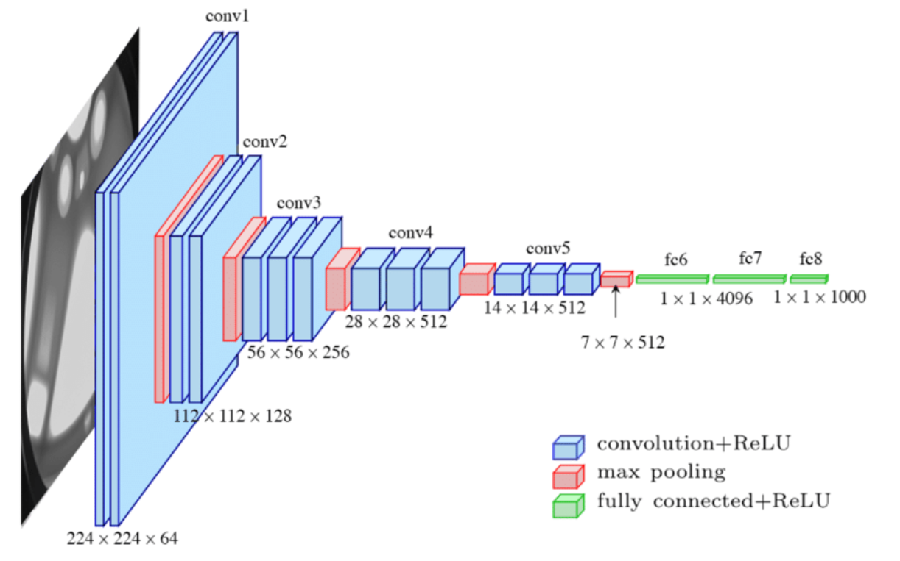
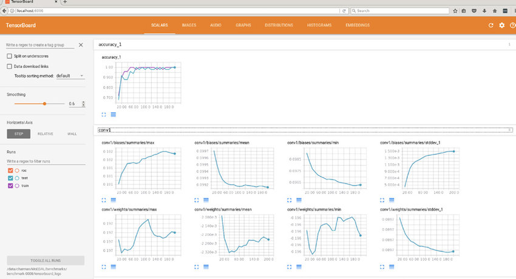
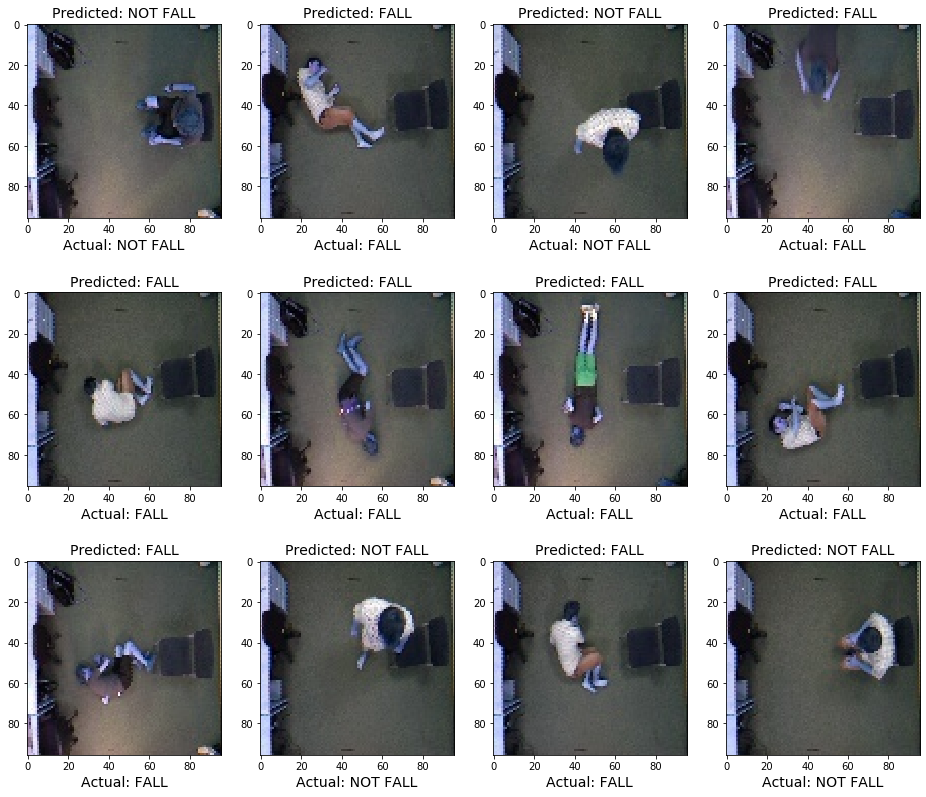
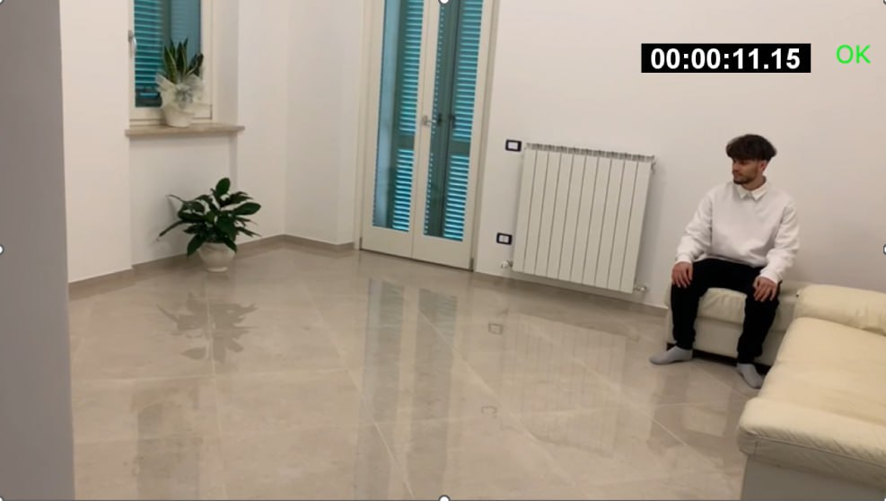
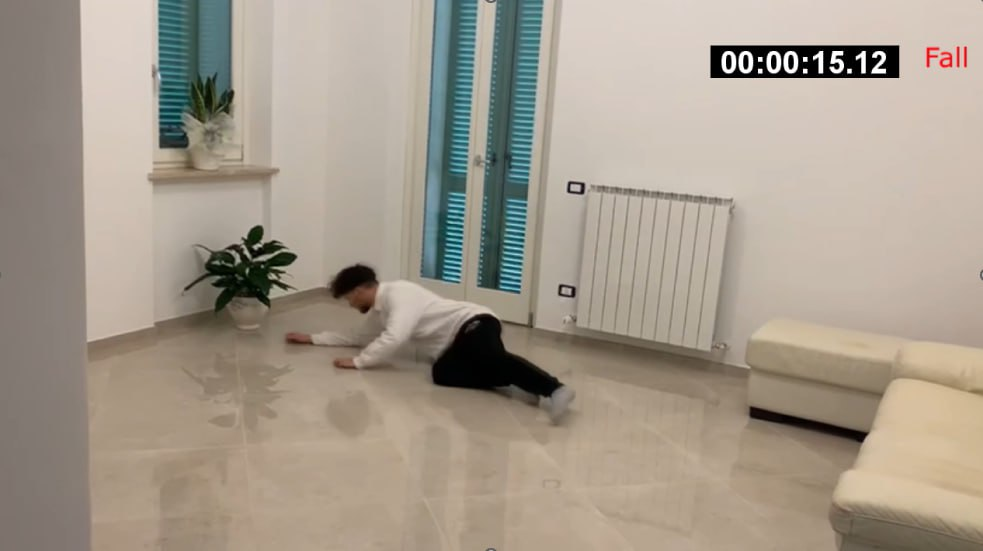

   <b>Un sistema camera-based per la fall detection in ambienti indoor</b>

---

    <b>FallDetection</b> è un progetto di <b>Deep Learning</b> realizzato in <b>Google Colab</b> per la tesi di laurea magistrale in Ingegneria Informatica.
   Per dettagli maggiori sui temi e metodologie sviluppate nel progetto, si consiglia di consultare l'elaborato scritto presente in questo repository: [FallDetection.pdf](https://github.com/xniola/FallDetection/blob/main/FallDetection.pdf)
</b>

# 📔 Tabella dei contenuti

- [Presentazione del progetto](#panoramica)
- [Tecnologie di base](#tecno)
- [Autore](#autore)

# 📝 Presentazione del progetto 

<table>
  <tr>
    
    
  </tr>
L’obiettivo di questa tesi è quello di costruire un sistema affidabile
per la rilevazione delle cadute basato su visione. La definizione del
problema è molto semplice. Si tratta di cercare di capire quando
una persona sta cadendo o è caduta. Nonostante il concetto
sia molto semplice, nella realtà dei fatti però per un sistema
artificiale può essere complessa l’interpretazione della posa delle
persone, in quanto queste possono compiere azioni apparentemente
sospette ma che non hanno niente a che fare con una caduta (ad
esempio abbassarsi per terra per raccogliere un oggetto, sdraiarsi
sul letto, sedersi per terra e cosi via). L’attività che rileva le
cadute si chiama fall detection ed è una tecnologia che monitora i
movimenti di una persona, rileva eventuali cadute che si verificano
ed eventualmente genera un allarme. A seguito dell’identificazione
dell’evento, si può avvisare l’operatore sanitario o l’assistente della
persona mediante smartphone. I sistemi di fall detection non sono
limitati solo alle persone anziane. Possono anche essere utilizzati
per proteggere atleti, lavoratori o chiunque sia a maggior rischio di
caduta. Le telecamere possono avere un posizionamento frontale
rispetto alla posizione della stanza, oppure possono essere poste
sul soffitto, in modo tale da aquisire la pianta dell’edificio che si
intende monitorare. 

# 🧰 Tecnologie di base 

La **fallnet** è stata pensata come una rete neurale convoluzionale(CNN).
Il modello viene utilizzato per l’elaborazione delle immagini e la
classificazione delle stesse in maniera indipendente l’una dall’altra.
La fallnet utilizza una serie di filtri che scorrono sull’immagine
e catturano caratteristiche specifiche delle immagini. Questi filtri sono in grado di identificare forme, texture, oggetti e altre
informazioni utili per la classificazione dell’immagine.
La rete è organizzata in strati, dove ogni strato utilizza i filtri
per analizzare i dati. I filtri sono condivisi tra i diversi punti
dell’immagine, che riducono la quantità di parametri che devono
essere addestrati e migliorano la capacità di generalizzazione del
modello.
Oltre ai filtri, sono presenti anche strati di pooling, che riducono
la dimensione dei dati elaborati e aumentano la robustezza del
modello. I dati vengono elaborati quindi attraverso una serie di
strati di convoluzione e pooling, che vengono seguiti da strati
densi, che forniscono la classificazione o la regressione finale.
Questo approccio rende molto efficace l’elaborazione delle immagini, poiché rende la rete in grado di catturare relazioni spaziali
tra i pixel dell’immagine. Queste relazioni spaziali sono importanti
per la comprensione delle immagini e possono essere utilizzate per
la classificazione delle immagini in cadute o non cadute.
La rete ottenuta è di semplice architettura ma risulta altrettanto
facile da scalare e allenare, risultando quindi molto comoda da
utilizzare su quantità di dati molto grandi.

**TensorFlow** è una libreria open source di intelligenza artificiale sviluppata da Google. È utilizzata per costruire e addestrare modelli di apprendimento automatico e per eseguire operazioni
matematiche su tensori, che sono array multidimensionali. 
Uno degli strumenti più utili forniti da Tensorflow è sicuramente
la sua dashboard, chiamata **TensorBoard**. La TensorBoard è uno
strumento basato sul Web per la visualizzazione, il monitoraggio
e il debug delle esecuzioni di TensorFlow. Fornisce informazioni
in tempo reale sulle tue corse di allenamento, tra cui precisione,
perdita e altre metriche, oltre a visualizzare e confrontare i risultati di più corse. La dashboard di TensorFlow è anche in grado
di visualizzare il grafico di calcolo e profilare le operazioni di TensorFlow. Può essere utilizzato in locale o in remoto ed è possibile
accedervi tramite Colab. Fornisce informazioni in tempo reale
sulle tue corse di allenamento, tra cui precisione, perdita e altre
metriche, oltre a visualizzare e confrontare i risultati di più corse.
L'immagine di Tensorboard affianco evidenzia come entrambi i modelli di visione (frontale e pavimentale) sono stati addestrati sul dataset
con 15 epoche e hanno raggiunto una precision finale maggiore del 95%.

Sono stati utilizzati due dataset differenti. Il primo di chiama
**UR Fall Detection Dataset**, e consiste in 140 video totali
proposti sia in forma frontale (chiamata "cam0") che pavimentale
(chiamata "cam1"). In particolare, per entrambe le cam vi sono
30 sequenze di caduta e 40 sequenze che vengono definite activity
day living, ovvero eventi quotidiani in cui le persone assumono
posizioni naturali da non confondere con cadute (es. movimenti
per sedersi, movimenti in cui ci si china per raccogliere un oggetto
o stendersi sul letto). Il dataset fornisce anche dati sensoriali
come quelli relativi all’accelerometro, tuttavia sono stati utilizzati
soltanto i dati utili per l’approccio camera-based.
Il secondo dataset è stato usato per estendere i dati del modello frontale e comprende 4 diversi ambienti di esecuzione cadute.
I quattro ambienti sono: **Casa**, **ufficio**, **sala caffè**, e **aula di lezione**.
Grazie all’estensione di questo nuovo dataset, la rete acquisisce
importanti capacità di generalizzazione. Non solo comprende che
le cadute sono indipendenti dalle caratteristiche dell’ambiente
in background, ma concepisce diverse modalità e movimenti di
caduta da persone diverse

Per concludere, è stato eseguito un test di inferenza tramite il
modello fallnet su un video personale. 

Nelle immagini di seguito
di mostra come il modello abbia imparato a distinguere lo scenario
di una caduta da uno di activity day living, come lo star seduti, e uno scenario reale di caduta.

# 🔭 Autore 

- [Stefano Perniola](https://github.com/xniola)
